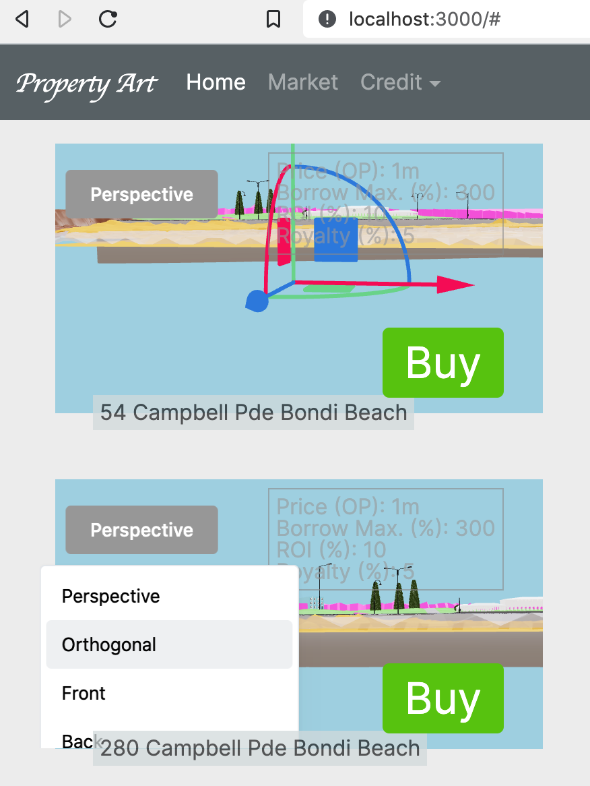

# Property Art (MUD v2 DApp)

## Screenshot



## Table of Contents

* [Features](#features)
* [Setup Development Environment](#setup-dev)
* [Links](#links)

### About <a id="about"></a>

* Goals
	* Build an autonomous world with digital twin of real-world real estate.
  * Replicate credit creation used by banks in CeFi but using NFT digital twin artworks of those real-world property assets so holders can borrow from DeFi using property art as collateral
  * Use zero knowledge where seller of NFT digital twin signs a transaction with a message provided by the buyer so the buyer knows that the seller owns the NFT digital twin without the seller having to send a transaction and use gas or reveal their identity.
	  * Example: Owner of Optimism account (tokens) with digital twin NFT wants to sell that NFT and its account to someone else without having to reveal the associated private key (and don't want to reveal that it's on the market, so nobody can tell who owns it either, but will say it's been sold only after, and not reveal the seller or buyer identity) or sending a transaction, instead only having to prove that they know the private key. For example, given a random message, sign that message with their ethereum account using `web3.eth.sign`), as a form of ZKP. Also try using EZKL https://www.youtube.com/watch?v=tp22vStPVG8 to do it in the browser with WASM using an example @lancendavis would publish
	    * Reference: Ali Baba Cave ZKP Example https://101blockchains.com/zero-knowledge-proof-example/
  * Autonomous world concept based on concept of location location location, hence chosen Bondi Beach to sell Property Art NFT. initially supply restrictions with design rights to IP at prestigous locations to incentivise fractionalising into units of those with large properties, where rules are that may only subdivide by the amount of units in the building
  * Royalty system such that each time there is a sale, 10% goes back to the creator for all subsequent sales in the autonomous world in perpetuity.
  * Affordable asset crisis age demographic locked out of real estate since they who buy digital assets
	* Incentivise buying and fractionalising Property Art NFTs in the first place if they exhibit a subdivision potential, since it democratises the traditional agent fee into royalties for all property artists.

### Features <a id="features"></a>

* General
  * [x] Generated component to import .glb format model using `gltfjsx`
  * [x] Updated to latest LatticeXYZ MUD v2 from `2.0.0-alpha` to `1.42.0` to resolve cache issues
  * [x] Integrate MetaMask using https://github.com/dubiella/mud-template-read-vite-metamask
* Creative use of MUD
  * [x] Integrates with generating MUD v2 stack with Docker https://github.com/ltfschoen/MUDTemplate
  * [x] `@react-three-fiber` with multiple scenes for each Property NFT Art listing with associated property highlighted in pink
  * [x] `@react-three/drei` for scene controls and animations
  * [x] UI has button to switching to different fixed camera views of each Property NFT Art
  * [x] UI has button to Preview RWA (real-world asset image associated Property NFT Art)

* Mod the OP stack and supercharge MUD
	* [ ] Fund an address using faucet and verify using Lattice testnet block explorer https://explorer.testnet-chain.linfra.xyz/
  * [ ] Changed from deploying locally with the MUD starting templates to deploy to the OP Stack Lattice testnet with `pnpm deploy:hackathon`
  * [ ] Use thirdweb to minting on OPstack since selling in OP tokens (autonomous world scale up solution) a Property NFT Art smart contract Property Art ERC-721 called "54 Campbell Pde Bondi Beach" (location).
    * [ ] smart contract to give royalty to seller using thirdweb
    * [ ] smart contract should have associated NFT link on Filecoin IPFS


* Decentralize Autonomous World
  * [ ] Deploy Property Art NFT to Filecoin IPFS using NFT.Storage as long-term storage service designed for off-chain NFT data (like metadata, images, and other assets) using NFT.Storage in a few lines of code to fully decentralize the Autonomous World.
    * Alternatively use Web3.Storage as storage helpers to decentralize your Autonomous World.
      https://nft.storage/
      https://nft.storage/docs/
      https://github.com/nftstorage
      https://twitter.com/nftdotstorage

* MUD Plugins & modules for ZK
  * [ ] EIP-4337 account abstraction user sign transaction burner wallet with `web3.eth.sign`

### Setup Development Environment <a id="setup-dev"></a>

* Install [Docker](https://docs.docker.com/get-docker/)
* Fork and/or clone repo.
  ```bash
  git clone https://github.com/ltfschoen/property-art && cd property-art
  ```
* Fetch just the ./docker & ./snippets folders and .dockerignore file from template project https://github.com/ltfschoen/MUDTemplate
* Generate .env file based on instructions in .env.example file, if desired.
* Build a Docker image and container `./docker/docker.sh`
* Wait... until terminal logs output `[client] Local: http://localhost:3000/`
* Open http://localhost:3000 in web browser to load MUD v2 DApp.

* Note: The .glb model file has not been uploaded to Github.

#### Restart Project

* Restart Docker.
* Restart Docker container `docker restart foundry`
* Enter the Docker container shell with `docker exec -it foundry /bin/bash`.
* Switch to the folder of your MUD v2 DApp and run it with:
  ```bash
  cd /opt/projects/property-art
  pnpm run dev
  ```
* Press CTRL+D to exit Docker container shell.

### Tools

* Convert .glb model to JSX component component file .jsx to import in React
    ```bash
    npx gltfjsx Bondi.glb
    ```
* Compression
  * https://threejs.org/docs/#examples/en/loaders/DRACOLoader
  * https://github.com/donmccurdy/glTF-Transform
    ```bash
    gltf-transform optimize ./projects/property-art/packages/client/public/Bondi.glb ./projects/property-art/packages/client/public/BondiCompressed.glb --texture-compress webp
    ```
  * https://meshoptimizer.org/gltf/

### Procedures

* Optimism Deployment
  * After deploying to Lattice testnet with `pnpm mud deploy --profile lattice-testnet` you need to `cd client`, change .env to `VITE_CHAIN_ID=4242` and run `pnpm vite` so your local accesses the testnet, then open browser with http://localhost:3000/?cache=false
  * Lattice network testnet https://explorer.testnet-chain.linfra.xyz/

### Maintenance

* Update to latest version of MUD v2 canary. Run the following in both the client/ and contracts/ folders, or `pnpm mud:up`
  ```
  pnpm mud set-version -v canary
  ```
* Check space used by testnet
  ```
  du -sh /root/.foundry/anvil/
  ```
* Delete the testnet data. Uses up 10Gb per 24 hrs (updating Foundry might resolve)
  ```
  rm -rf /root/.foundry/anvil/tmp
  ```
* Update to the latest version of Foundry with `foundryup`

### Links <a id="links"></a>

* MUD v2 https://v2.mud.dev
* MUD 101 video https://www.youtube.com/watch?v=eaLv0FNEf8A
* MUD MetaMask integration https://github.com/dubiella/mud-template-read-vite-metamask
* three.js vanilla
    * examples
        * https://jsfiddle.net/dypoq394/
* React-three-fiber
    * examples
        * UI building example https://www.youtube.com/watch?v=5hhMamMgcIk
        * load models https://docs.pmnd.rs/react-three-fiber/tutorials/loading-models
        * multiple scene examples
            * https://codesandbox.io/s/multiple-views-with-uniform-controls-r9w2ob
            * https://codesandbox.io/s/view-tracking-bp6tmc
        * adding and removing mesh and bodies https://github.com/patrick-s-young/dynamic-react-three-fiber-example
    * `gltfjsx` to convert `.gltf` or `.glb` to a JSX component
        * https://blog.logrocket.com/configure-3d-models-react-three-fiber/
* EZKL video https://www.youtube.com/watch?v=tp22vStPVG8
* EZKL docs https://docs.ezkl.xyz/
* Similar websites
  * RealT https://realt.co/marketplace/ (note: Property Art is not making a financial asset like Realt)
  * Sominum Space https://opensea.io/assets/ethereum/0x913ae503153d9a335398d0785ba60a2d63ddb4e2/1091

### Troubleshooting

* `Uncaught Error: Element type is invalid: expected a string (for built-in components)`
  * This means you're trying to use a an icon from https://tabler-icons.io/ that doesn't exist
